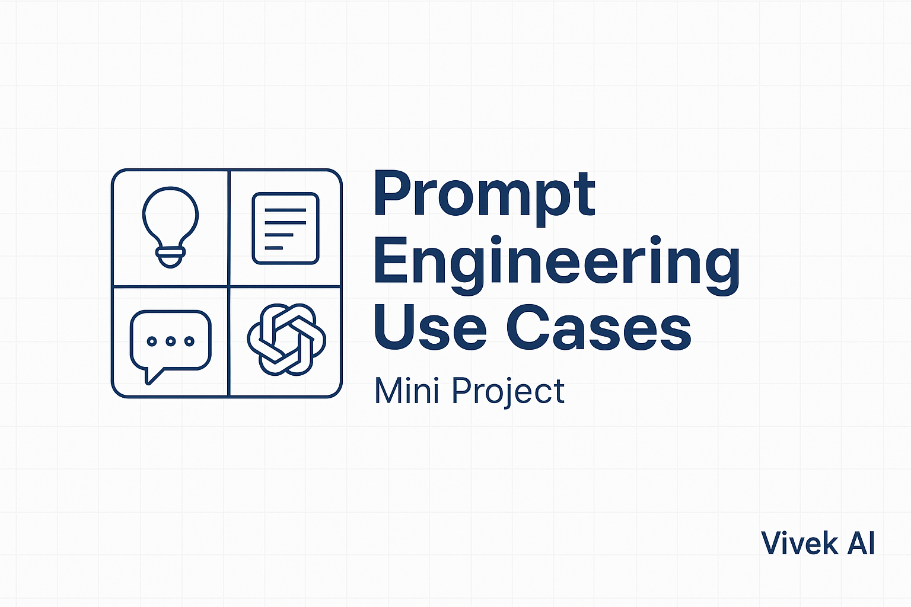

<p align="center">
  
</p>

# Prompt Engineering Use Cases — Mini Project

**By Vivek AI**

This mini-project showcases three real-world problems and how Large Language Models (LLMs), through prompt engineering, can solve them efficiently. Each use case is structured as a practical solution with a specific prompt and prompt tuning parameters (`temperature`, `max_tokens`, etc.) to achieve the best output.

---

## 🟩 Use Case 1: Summarizing Customer Feedback for a Small Business

### ✅ Problem
Small businesses often receive customer feedback via Google reviews, WhatsApp chats, or social media comments. This feedback is unstructured and hard to analyze manually.

### 💡 LLM Solution
Use prompt engineering to extract sentiment, identify trends, and convert raw text into actionable summaries.

### 🧠 Advanced Prompt Example
```plaintext
Prompt:
"Read the following customer reviews and summarize them under three categories:
1. Positive Highlights
2. Common Complaints
3. Suggestions for Improvement

Respond in bullet points for each category."

Input: [Paste the raw customer feedback here]

Parameters:
- temperature: 0.4  # Low randomness for objective summary
- max_tokens: 600   # Allows detailed but concise output
- frequency_penalty: 0.2  # Prevents repetition of same points

```

### 🎯 Outcome

- Decision-making insights from unstructured reviews.
- Improved product/service quality.
- Ready-to-share summaries with stakeholders or teams.

---

## 🟩  Use Case 2: Generating Blog Post Outlines for Content Creators

### ✅ Problem
Content creators face creative fatigue while planning blog topics and outlines, especially under publishing pressure.

### 💡 LLM Solution
Prompt engineering helps generate title ideas, blog outlines, subheadings, and even SEO-friendly structures in seconds.

### 🧠 Advanced Prompt Example
```plaintext
Prompt:
"As a SEO Expert, Generate a human friendly structured blog post outline for the topic:
'The Benefits of Daily Meditation for Students'. 

Include:
- An SEO-optimized title
- A short introduction paragraph (2–3 lines)
- 5 main headings
- 3 bullet points under each heading
- A conclusion suggestion"

Parameters:
- temperature: 0.7  # Balanced creativity
- max_tokens: 750
- frequency_penalty: 0.1

```

### 🎯 Outcome

- Jump-starts blog creation process.
- Ensures structure and keyword relevance.
- Saves time while enhancing quality.

---

## 🟩  Use Case 3: Creating Personalized Study Plans for Students

### ✅ Problem
Many students don’t know how to plan their studies based on available time, weak subjects, and deadlines. This leads to inefficient preparation.

### 💡 LLM Solution
Prompt engineering can personalize study plans by processing availability, subject strength, and exam goals.

### 🧠 Advanced Prompt Example
```plaintext
Prompt:
"Create a personalized 30-day study plan for a Class 10 student preparing for board exams in Science and Math. 

Constraints:
- The student has 2 hours per day.
- Physics is a weak subject.
- Weekly review sessions should be included.
- Plan should balance difficult and easy topics each week.

Format output as:
Day X - Subject: Topic

Parameters:
- temperature: 0.6  # Logical planning with moderate variation
- max_tokens: 1000
- presence_penalty: 0.3  # Encourage diversity in daily topics

```

### 🎯 Outcome

- Custom, realistic, and focused study planning.
- Better engagement and confidence for students.
- Teachers/tutors can easily adapt or review the plan.

---

### 📌 Conclusion

These examples demonstrate how LLMs, when guided with well-structured prompts and fine-tuned parameters, can become powerful tools for solving everyday human problems—from education to business to creativity. This mini-project is a foundational step in building real-world prompt engineering intuition.
    

    

    
